**Goals:**
- [x] transmit 16 RC channels
- [x] transmit RSSI and two custom values (A1, A2) from air to ground
- [x] transmit bidirectional telemetry stream (serial bridge) 
- [x] build external module for Jumper T-Lite 
- [x] build receiver based on Wemos D1 Mini board (Servo/PWM outputs) 
- [x] build ESP-01 based SBUS output receiver 
- [x] build ESP32 based SBUS output receiver, LR mode 
- [x] external module for Jumper T-Lite: select active profile by CH16 value 
- [x] DYI RC Controller
- [ ] test range with xq-02a amplifier
- [x] external module for Jumper T-Lite: multiple profiles in xml file
- [ ] external module for Jumper T-Lite: web page for profiles editing
- [x] external module for Jumper T-Lite: bluetooth gamepad mode
- [ ] external module for Jumper T-Lite: telemetry translation: Mavlink stream -> SPORT
- [ ] external module for Jumper T-Lite: telemetry translation: CRSF stream -> SPORT
- [ ] SBUS receiver: SPORT telemetry quering
- [x] PPM output
- [x] Mavlink RC

# hx_espnow_rc

Remote control library based on ESP-NOW protocol (PlatformIO, ESP32 and ESP8266)

Transmits 16 channels at 50 Hz, bidirectional telemetry(transparent stream) and RSSI, A1, A2.

Can be used as cheap RC for LOS flights or up to 2km flights.
Main goal is to use it in the DIY ESP8266/ESP32 based projects.

Used in external RC Controler JR Bay module: [/doc/tx_external_module.md](/doc/tx_external_module.md)

Used in DIY RC Controller: [/doc/tx_diy_controller.md](/doc/tx_diy_controller.md)

Used in DIY ESP32 based quadcopter: https://github.com/RomanLut/Multiwii-ESP32-port

Used in DIY ESP8266 plane: https://www.youtube.com/watch?v=c9dDOX0IzME

Used in INAV 1.7.3 plane: https://www.youtube.com/watch?v=UptvxsFHDFA

Used in INAV 3.0.2 plane: https://youtu.be/GYB-UckucRA

# Building guides

You can build **transmitter module for RC Controller with External module bay**, **DIY RC controller**, and **SBUS/PPM/PWM/Mavlink receivers** using guides below.

## Transmiters
- transmitter module for Jumpter T-Lite (JR Bay): [/doc/tx_external_module.md](/doc/tx_external_module.md)
- DIY RC Controller: [/doc/tx_diy_controller.md](/doc/tx_diy_controller.md)
- *module for Radiomaster TX16s JR bay [todo]*

## Receivers

**SBUS wihh transparent bidirectional telemetry**
- ESP-01 based SBUS receiver: [/doc/rx_esp01_sbus.md](/doc/rx_esp01_sbus.md)
- Wemos D1 Mini based SBUS receiver: [/doc/rx_d1_mini_sbus.md](/doc/rx_d1_mini_sbus.md)
- ESP32 based SBUS receiver: [/doc/rx_esp32_sbus.md](/doc/rx_esp32_sbus.md)

**Mavlink RC with telemetry** 
- ESP-01 based Mavlink receiver: [/doc/rx_esp01_mavlink_rc.md](/doc/rx_esp01_mavlink_rc.md)
- Wemos D1 Mini based Mavlink RC receiver: [/doc/rx_d1_mini_mavlink_rc.md](/doc/rx_d1_mini_mavlink_rc.md)
- ESP32 based Mavlink RC receiver: [/doc/rx_esp32_mavlink_rc.md](/doc/rx_esp32_mavlink_rc.md)

**PPM with transparrent bidirectional telemetry**
- Wemos D1 Mini based PPM receiver: [/doc/rx_d1_mini_ppm.md](/doc/rx_d1_mini_ppm.md)
- ESP32 based PPM receiver: [/doc/rx_esp32_pmm.md](/doc/rx_esp32_ppm.md)

**PWM**
- Servo/PWM/Discrete output receiver based on Wemos D1 mini board: [/doc/rx_d1_mini_pwm.md](/doc/rx_d1_mini_pwm.md)

Development guide: [/doc/development.md](/doc/development.md)

Recommended antenna: DIY Moxon antenna https://www.thingiverse.com/thing:5148464

Recommended telemetry viewer application: https://github.com/RomanLut/android-taranis-smartport-telemetry

# Range

Range is up to 3Km. Below are real world test results. 

Range depends on used antennas, LR mode and noise level in the area. LR mode adds ~30% to the range. LR  receiver sensitiviy is -98 dbm. 

As can be seen, range can be 2x higher on area with lower noise level! 

Range testing is done in the clear line of sight conditions. 

## 2 dbi dipole antenna on transmitter, PCB antenna on recever, Noise level -90dbm
Range is less then 150m.

## 2 dbi dipole antenna on transmitter, whip antenna with stripping wire on receiver , Noise level -90dbm
Range is ~250m

## 2dbi dipole antenna on transmitter and receiver, Noise level -90dbm
Range is ~1Km 

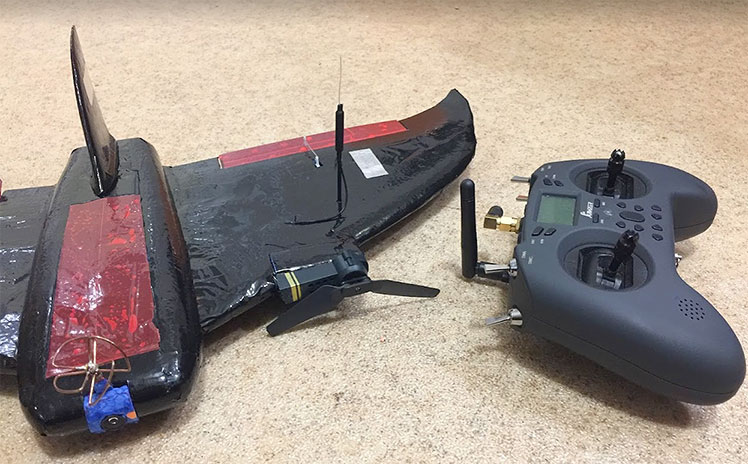

Tested with INAV 1.7.3 Naze32 1s flying wing based on Eachine E58 brushed motors, with HX_ESPNOW_RC SBUS Esp-01s based receiver https://www.youtube.com/watch?v=UptvxsFHDFA.

I have got first failsave event at 950m and still could control plane at 1100m:

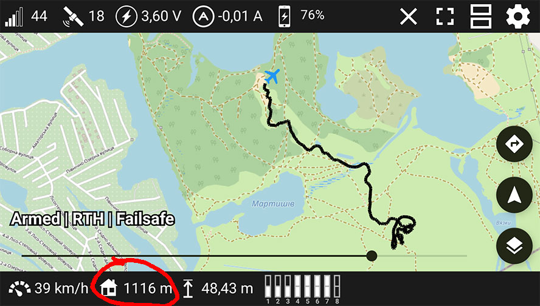

*Failsave period is set to 1 second (so there should be at least 1 successfull packet delivery in 1 second). Note that range of actual communication is larger, but is not usefull for RC.*

## 5 dbi dipole antenna on transmitter with 2dbi dipole antenna on receiver, Noise level -90dbm
Range is ~1.3Km 

5dbi TP-Link antenna with RP-SMA-SMA 

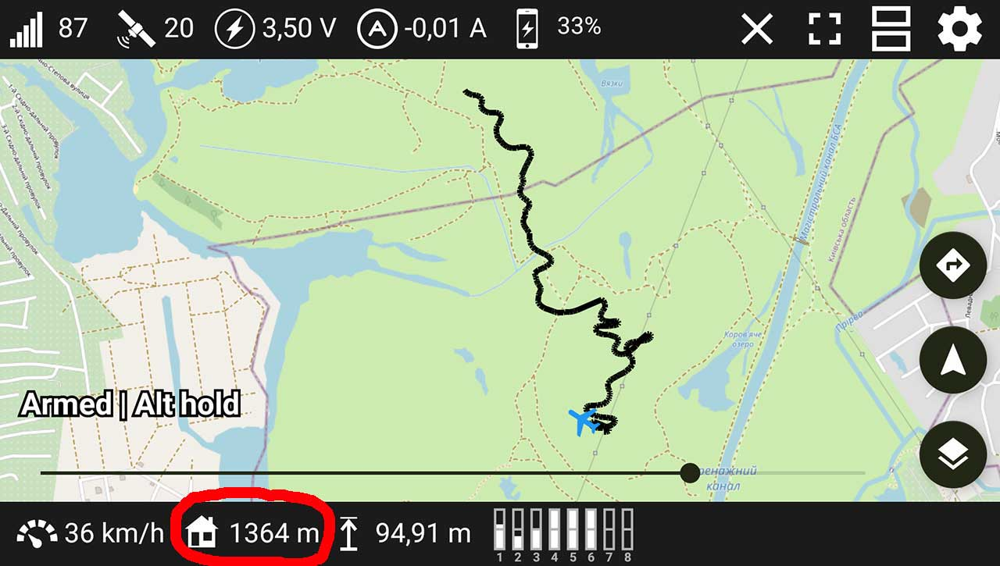

## 5 dbi dipole antenna on transmitter with 2dbi dipole antenna and ESP32 LR receiver, Noise level -90dbm
Range is ~1.8Km 

5dbi TP-Link antenna with RP-SMA-SMA adapter, ESP32 LR mode

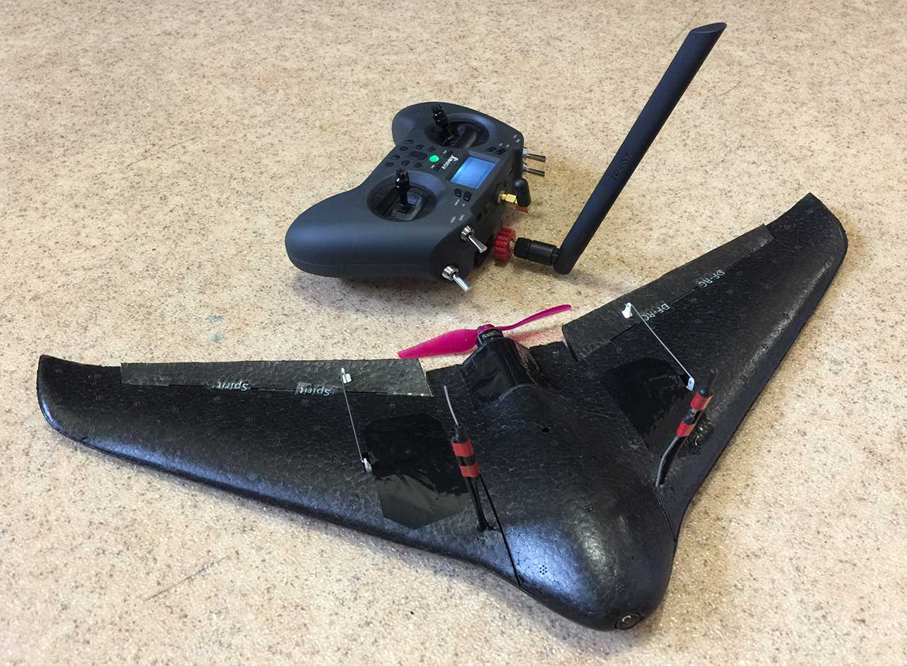

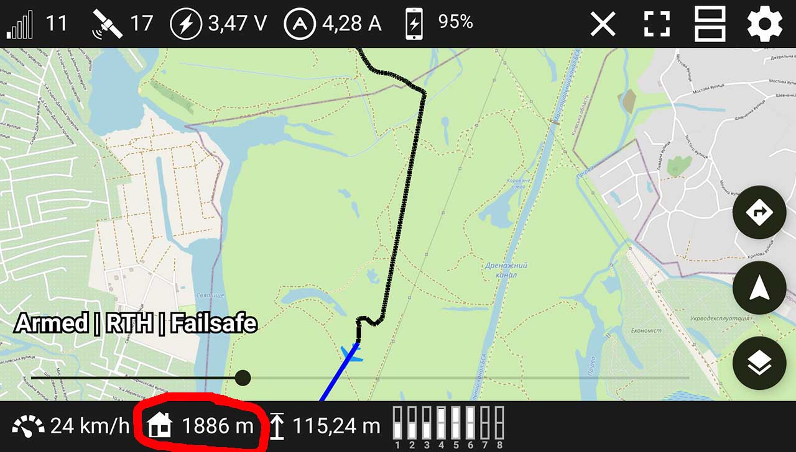

Tested with INAV 3.0.2 DF mini Spirit 1s flying wing, ESP32-based SBUS receiver, LR mode https://youtu.be/GYB-UckucRA

## Moxon antenna on transmitter with 2dbi dipole antenna and ESP32 LR receiver, Noise level -90dbm 
Range is ~1.7Km

DIY Moxon antenna on transmitter https://www.thingiverse.com/thing:5148464

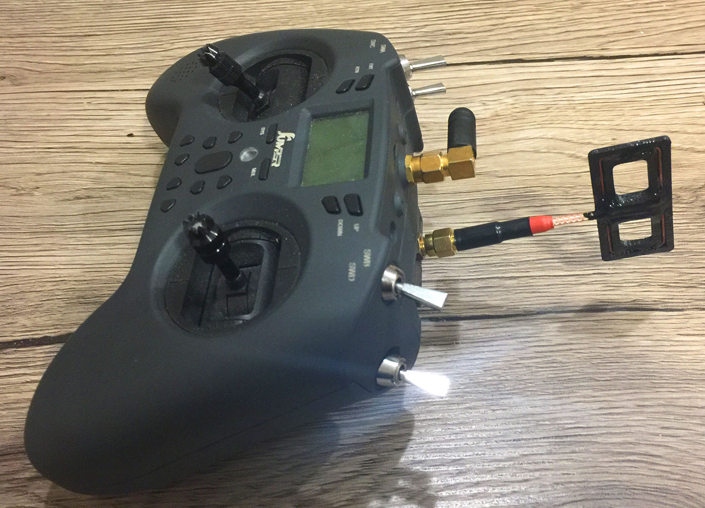

Tested with INAV 3.0.2 DF mini Spirit 1s flying wing, ESP32-based SBUS receiver, LR mode.

DYI moxon antenna perform similar to 5dbi antenna, while having compact size. 

**Moxon antenna is recommended antenna for hx_espnow_rc project.**

## BetaFPV Moxon antenna (for ELRS 2.4GHz) on transmitter with 2dbi dipole on receiver, Noise level -96dbm
Range is ~2.7Km

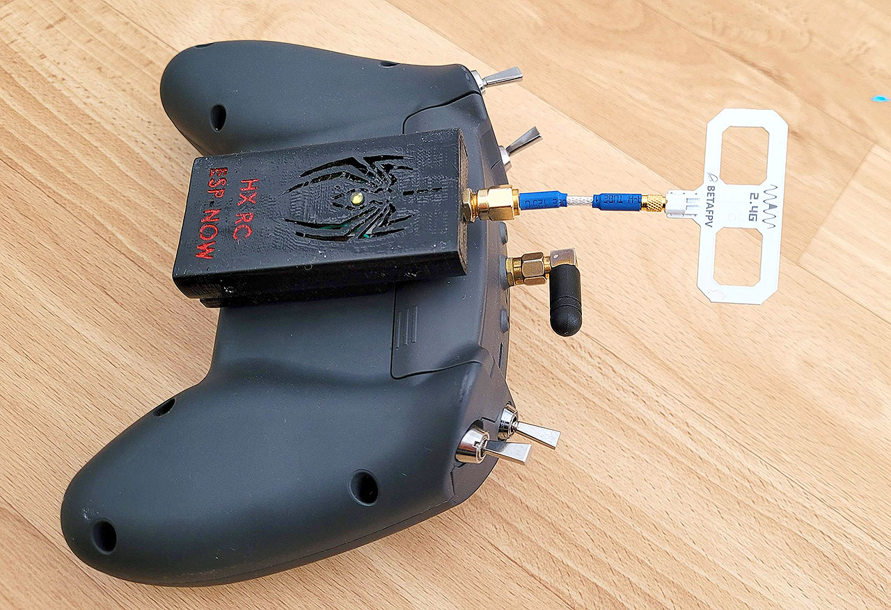

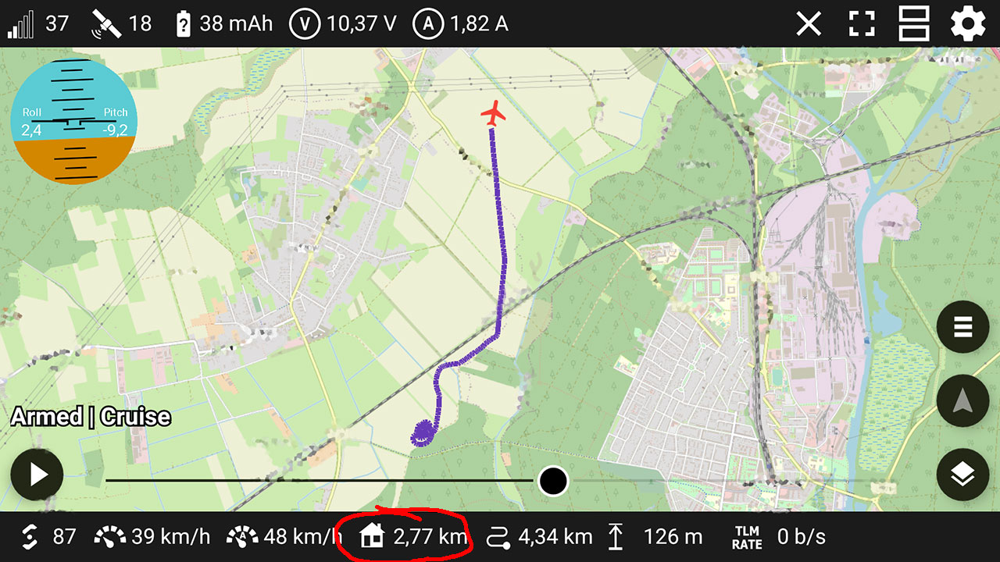

## DIY controller, Mavic mini antenna on transmitter with 2dbi dipole on receiver, Noise level -96dbm
Range is ~2.5Km

DIY RC Controller: [/doc/tx_diy_controller.md](/doc/tx_diy_controller.md)

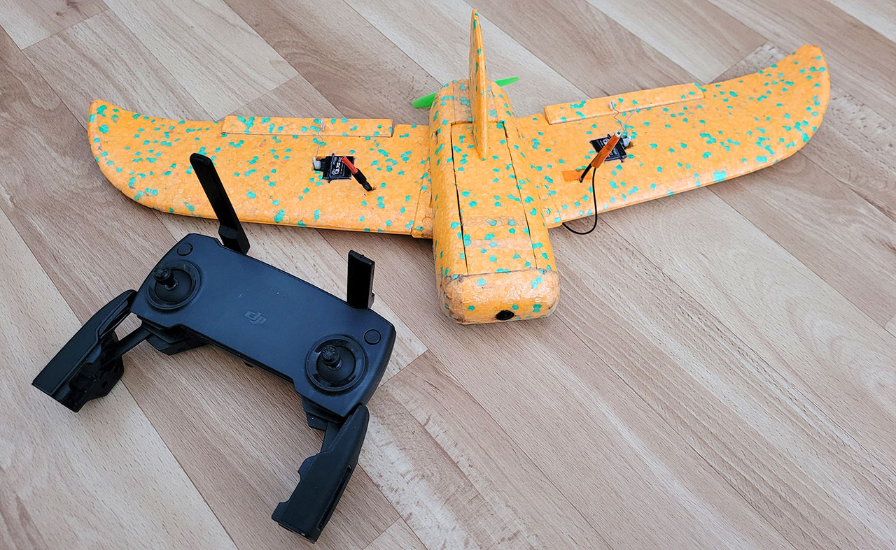

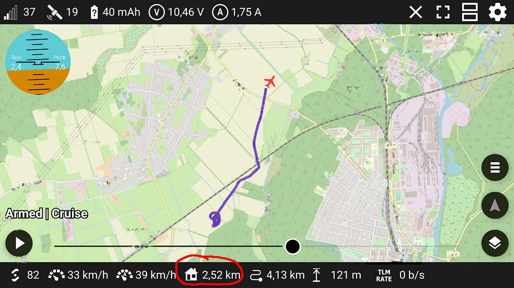

## DIY controller, Mavic mini antenna with Yagi attachment on transmitter with 2dbi dipole on receiver, Noise level -96dbm
Range is ~3.1Km

DIY RC Controller: [/doc/tx_diy_controller.md](/doc/tx_diy_controller.md)

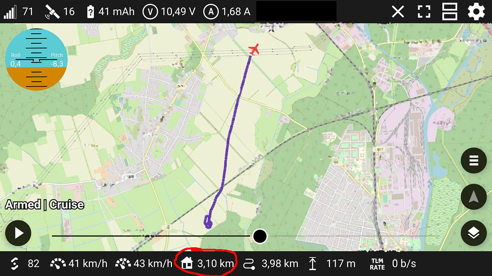

## FRSky Patch clone

I also tested with Frsky directional patch 7dbi antenna clone, and I was not able to get any good result with it. I got a lot of failsafe events at 700m already.

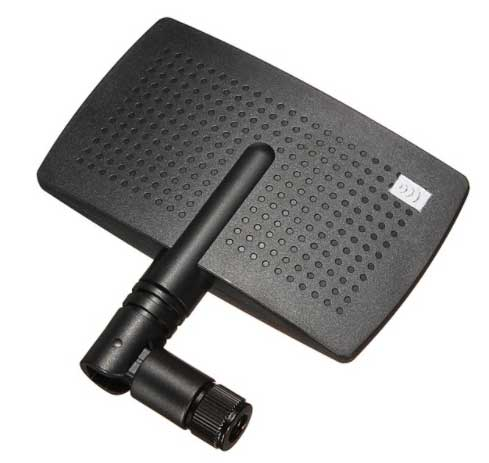

I am not sure if this is caused by poor clone quality, my ability to point in the right direction, or poor antena SWR.
(I know I have to open the clone and rotate inner part in the right direction).

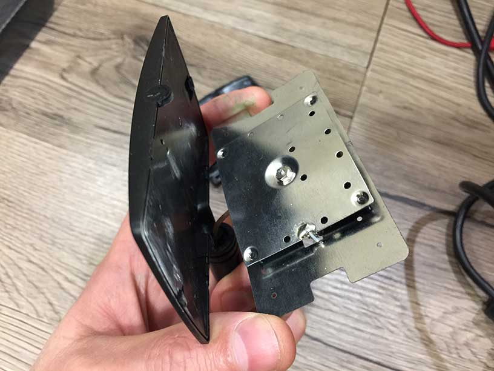

# Packet rate

Packet rate is 50 packets/second in LR and normal modes.

See:  [/doc/packet_rate.md](/doc/packet_rate.md)

# Telemetry
Telemetry stream is transparent and CRC protected. Data is ensured to be delivered without distortion, unless failsave or overflow condition araise. Stream can be used to transfer Mavlink, MCP, Sport, LTM etc. telemetry. 

Downlink data rate is ~57kBit/sec in normal mode and ~2.4kBit/sec in LR mode.
Uplink data rate is ~12kBit/sec in normal mode and ~2.4kBit/sec in LR mode.

Additionally library transmits A1 and A2 (32-bit) values for simple telemetry.

# Building and Flashing
Currently pre-build firmware is not provided. You have to build firmware yourself and flash ESP32/ESP8266 modules using PlatformIO https://platformio.org/

If you do not know what PlatformIO is, than this project is not for you at the current stage. Later I may try to provide pre-build binaries and detailed instructions for flashing and configuring transmitter and receivers.

See development guide: [/doc/development.md](/doc/development.md)

# Quick start

- get two ESP32 Devkit boards
- flash one with test_esp32_devkit_rx project
- flash second with test_esp32_devkit_tx project
- see statistic in terminal

Continue with development guide: [/doc/development.md](/doc/development.md)

# Other projects

https://github.com/PepeTheFroggie/EspCopter

https://github.com/PepeTheFroggie/EspCopter32

https://github.com/Crypter/ESP-RCLink

https://github.com/RomanLut/mahowii

https://github.com/martin-ger/ESP_E58-Drone

https://github.com/Hermann-SW/wireless-control-Eachine-E52-drone
